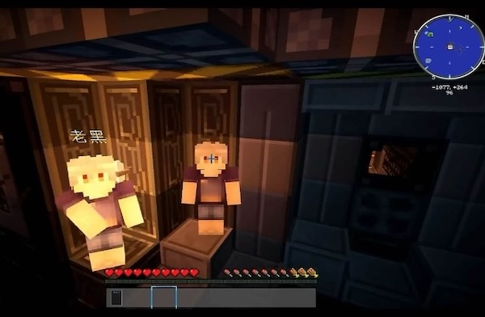
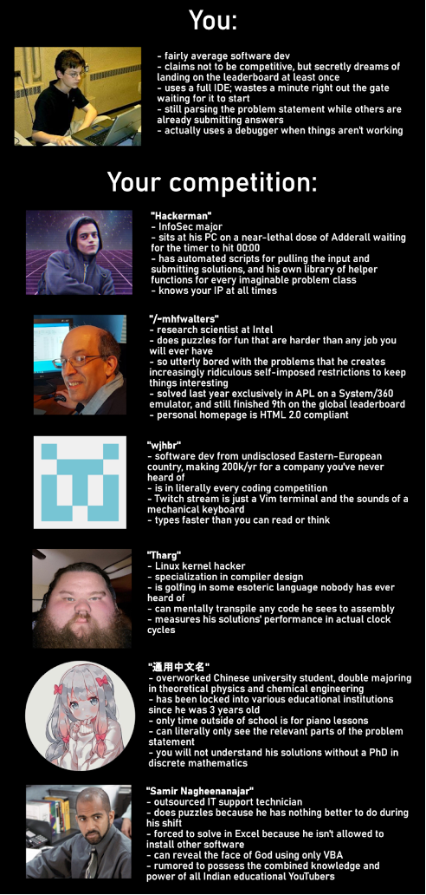
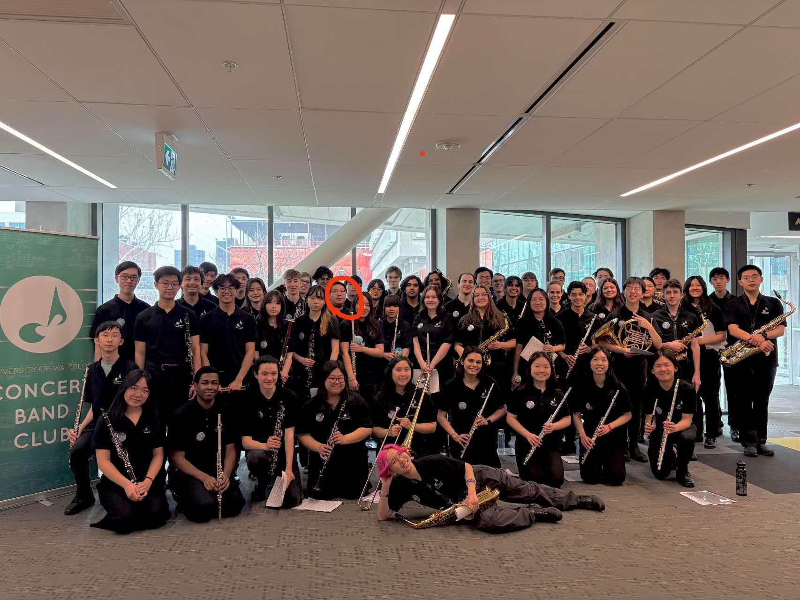

# What is this?

These are a bit of my personal stories, if you are interested. If you are an HR looking for my projects and experiences, then you are probably in the wrong file. Open the terminal and type `find ./ -name "MoreAboutMe*"`, this is the file you are looking for. (Terminal is still WIP)

I mean, nothing here is technical, nor are they related to any of my skills. This file is more like a tree hole. I want to write something about my true thoughts, and hope someone will resonate with me.

This file is very long, it is about my past, my stories, my thoughts, it's more like a blog rather than a simple "More About Me" page. However, if you really want to learn more about me, to learn why I chose coding, why I call myself "OFTS"... You are welcome to stay! You can find everything about me here.

# So, Why Software Engineering?

I’ve seen a lot of people choose software engineering for either a high salary, parental pressure, or peer pressure. You think I am the same? No! I do have my unique story about coding.

:::: columns flex="1 1"
::: column
I believe everyone has played Minecraft, or at least heard of it, right? That's where the whole store began. Minecraft is famous for its modding community. When I wrote this article, Minecraft had approximately 200k mods on CurseForge (the largest mod platform for Minecraft), not counting those that are not uploaded to CurseForge. When I first got in touch with these mods in elementary school, I was shocked by the infinite possibilities they bring. Gradually, a thought popped into my head: Can I make my own mod?

This is a screenshot of the modpack (made around 2016 ) that sparked my idea for making my own mod.

Note that the original video was lost; this is an archive.
:::

::: column

:::
::::

The power of a childhood dream is invincible. This ambitious thought encourages me to learn coding, modding, and these coding platforms and frameworks… Now, I can confidently say that I am a modder, a good modder, a modder with 10k+ cumulative downloads. Now that I've successfully accomplished the goal I set for myself in elementary school, after seeing the power and possibility of coding, I believe this is the job I want to do when I grow up. Without hesitation, I wrote down 'Software Engineering' on my university application, and this is the whole story behind it.

# What does 'OFTS-CQM' stand for?

Well, I have used that name as my Minecraft ID for several years. CQM is the acronym of my Chinese name Chen Qianmu, and OFTS is a bit complicated.

Back then, there was a game called Minecraft: Story Mode (the company that made it went bankrupt, so it's no longer available). It talks about the adventures of a team called the Order of the Stone. Yes, that's where OFTS come from. Order oF The Store. I forgot the exact reason why I called it OFTS instead of OOTS or something else. I picked the name almost 10 years ago. I remember it comes from the Order of The Stone, but I forgot the details.

Back then, I really liked the Order of the Stone, and I imagined that I was a member of them, exploring the world and defeating the evils. C'mon, everyone has a heroic childhood dream, right? So I added my name after the acronym OFTS, so it becomes OFTS-CQM.

In fact, not limited to Minecraft, most of my game accounts uses OFTS-CQM, including GitHub, because it was originally used to store my mods' code.

# Any interesting stories about Minecraft and coding?

As we all know, Minecraft (Java Edition) uses Java! Therefore! If I want to make mods for Minecraft, I should learn Java! That was exactly what I thought! So, my first programming language is Java...Script!

Yes that is the real story. I searched java and the first thing poped up was javascript.

I thought javascript is some kind of formal name of Java, because you know, programmers like to use abbreviations.

Literally, I spent four months learning javascript and still couldn't read Minecraft's source code. I told myself that it is gonna be hard, not everyone can be a programmer, it probabaly takes a year or two to be proficient enough to read Minecraft's code... UNTIL I REALIZED I WAS LEARNING THE COMPLETELY WRONG LANGUAGE!!! FUUUUUUUUUUU**

# What do you think about AI?

AI is the greatest tool ever invented; with the help of AI, I gain unimaginable productivity. I have to be honest, without AI, I lost most of my efficiency, but with the help of AI, I can vibe-code or semi-vibe-code comprehensive systems and software.

## Do you like to use AI?

Actually, no... which may surprise you. This is my honest answer. You see, I study software engineering because coding is an enjoyable thing. If it's not enjoyable, why would I choose this major? But, to me, the process of coding is what is enjoyable. The outcome, the result... not really important. Coding, debugging, sitting in front of the computer wondering why this doesn't work, and sitting in front of the computer celebrating it finally works, are all processes of coding, which I consider to be enjoyable, even debugging for hours.

As you can see, AI destroys this feeling. Coding is like a video game, the enjoyable part is not the final "Thank you for playing" screen, the enjoyable part is the process itself. If there is a button that skips the entire process and jump directly to the final scene, would you press that button? You won't.

If I made a project, I get a sense of pride and a sense of achievement. If I let AI do it, I get nothing, because this is literally other people's work. Sometimes I struggle about this. If I don't use AI, then I lose productivity. If I use AI, then I lose fun.

## Then, are you still OK with using AI in work?

If AI is required to boost productivity, then definitely. This is my work, and I have the responsibility to deliver my content on time with high quality. I am not an AI hater, nor an AI fan; it is just a tool that is unfortunately not my top choice. I still use AI, and know very well how to use AI.

It is the future of work, the future of software engineering. I am still very agile, able to adopt to new technology. Back to the button + video game metaphor, if you are getting paid to speadrun videogames, would you press that button? Of course! I will press that button to death.

# Why "Macrohard Virtual Studio"?

I want to make my website unique and stand out. I want to make a website that looks like a programmer's website. It shouldn't be a generic one nor should it looks like something vibe-coded in 10 minutes.

It should be something technical, related to programmers, related to coding. I couldn't image what design should I choose, but I had a basic outline of what I should put on my website. Therefore, I opened VS Code and decides to write something down first, and then I realized this is the exact thing I am looking for.

So yes, I created this Macrohard Virtual Studio v6.7.0. Renamed it because I don't wanna get sued by Microsoft.

# How Do You Feel About Studying Software Engineering?

## Here is a meme from reddit:

::: accordion title="Click to see..." open=false

:::

# I heard, you are in a band?

:::: columns flex="1 1"
::: column
Yes! Study is kinda boring, so I joined a band. In fact, I am considering joining another band, so next time you open this website, it might be "bands" instead of "band".

The band is called UWCBC (University of Waterloo Concert Band Club), and I play Euphonium in it. If you don't know what Euphonium is, it's similar to a Tuba but a lot smaller, to the size of a Frech Horn.

It is very fun, I recommend everyone to join a band. I've been playing music since elementary shcool, and to me, music is already an indispensible part of my life.
:::

::: column

:::
::::
