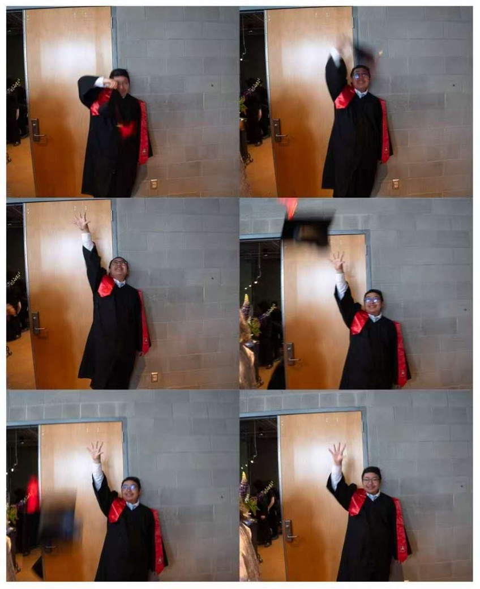

# Welcome to OFTS_CQM (Sam Chen)'s Codespace!

:::: columns flex="4 6"
::: column

*Picture by my highschool friend Wilson*
:::

::: column
Congradulation! You found OFTS_CQM (Sam Chen)'s codespace! You can find anything about OFTS_CQM here!.

OFTS_CQM is a Software Engineering Student at the University of Waterloo, excited to explore the world of computing, web & app development, video game design… and a lot more!

There's a lot more I'm doing. They'll show up here (or on LinkedIn) if I'm done.

I don’t know everything, but I am still learning! I am willing to learn more about software engineering, coding, and the languages and frameworks that go with it.

By the way, I am more a back-end guy, so this website is kinda shitty. Don't blame me if you don't like this vscode styled design.

## ---- By OFTS_CQM
:::
::::

## What’s Your Tech Stack?

I am proficient in common OOP languages such as C# and Java, as well as game engines like Unity. Other than video game stuff, I also do website development. I am proficient in front-end frameworks such as ReactJS and Vue, with other technologies such as css, tailwind css, and html. For background, no Spring Boot yet, but I can use other common Java/Kotlin frameworks such as Javelin and Ktor, as well as Python frameworks such as Flask. I have Android development experience with Android Studio and Java/Kotlin, and desktop development with JavaFX, Java Swing, or Qt/QML.

## Whats your university?

:::: columns flex="10 4"
::: column
I currently study Software Engineering in University of Waterloo. It is definately a very stressful major, I have to be honest, but I learned a lot, and made a lot of friends, I even joined a band. Despite its stressful study, I still find it to be an enjoyable university life.
:::

::: column

*Picture by University of Waterloo*
:::
::::

## If you want to find out more about me, you can go to the file explorer at the left side (or bottom on mobile)!
