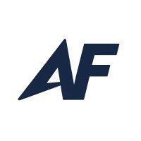

# My Work Experience

:::: columns flex="3 7"
::: column

:::

::: column
My first and only work experience is [Ascendance Foundry](https://www.ascendancefoundry.com).

Ascendance Foundry is a consulting firm that brings automation to various industries. Ascendance Foundry sends "Forward Deployed Engineers" to various industries to help them integrate AI into their existing workflows and boost productivity. Now, as agentic coding becomes more widespread, it significantly reduces the cost of customized software, making it affordable for small companies. However, this also requires developers' discipline to build maintainable, scalable software. 

:::
::::

In Ascendance Foundry, I worked for a private equity firm to automate their accounting process. Utilizing their Microsoft stack, by connecting to different platforms, I was able to automate processes including but not limited to **payroll processing**, **expense recharging**, **financial statement generation**, and **managing deal transactions**. 

With the help of AI, plus my knowledge learned from University and my personal projects, I am able to compress these processes that used to take a few days down to just one click, while significantly reducing the bookkeeper error rate. This is because humans' errors compound. Even if you can do 95% of your journals correctly, well, a month's deal contains 29 journals to post, which brings the possibility down to 0.95^29 = 22.5%. With the accounting automation, because data are all computed from well-configured tables and are automatically validated based on a rule set, that brings the error rate down to zero. 
